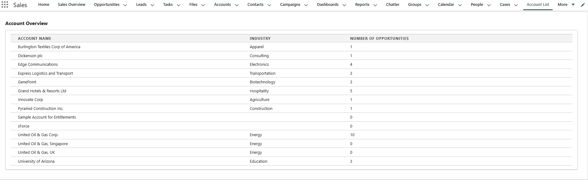

# Project Documentation: TechCo Account Viewer

Author: Wonga Myendeki
Date: October 15, 2025
Version: 1.0

## Executive Summary

This document outlines the technical architecture, design principles, and setup instructions for the TechCo Account Viewer, a custom solution built on the Salesforce Platform. The project's goal was to provide TechCo's account managers with a clean, user-friendly interface to view key account and opportunity data at a glance.

The solution combines a Visualforce page for displaying a tabular list of accounts with a modern Lightning Web Component (LWC) for data visualization. The design is anchored by a single, efficient Apex controller, emphasizing simplicity, maintainability, and a seamless user experience that aligns with the native Salesforce Lightning interface.

## Application Screenshot

Below is a screenshot of the Account Overview page showing the account list with opportunity counts:



The interface displays:

- **Account Name**: List of all accounts in the system
- **Industry**: The industry classification for each account
- **Number of Opportunities**: Count of related opportunities per account

## 1. Project Scope & Objectives

A core principle of this project was to adhere to a well-defined scope, ensuring the delivered solution directly addressed the primary needs of the end-user without introducing unnecessary complexity.

### 1.1. In Scope

- Account List View: A Visualforce page displaying a list of Accounts with three key fields: Account Name, Industry, and a calculated count of related Opportunities.
- Opportunity Chart: A Lightning Web Component that visually represents the distribution of all Opportunities by their current Stage.
- Unified Data Source: A single Apex controller to serve data efficiently to both the Visualforce page and the LWC.
- UI/UX: A clean, user-friendly interface styled with the Salesforce Lightning Design System (SLDS) for a consistent look and feel.

### 1.2. Out of Scope

- Data Modification: The interface is read-only. Functionality for creating, editing, or deleting records is not included.
- Advanced Filtering: The solution does not include dynamic filtering or search capabilities.
- Real-time Updates: The components do not automatically refresh with live database changes; a page reload is required to see new data.

### 1.3. Target User Persona

- Role: Account Manager at TechCo Services.
- Goal: To quickly assess the status of their accounts and the overall health of the opportunity pipeline.
- Pain Point: Needs a consolidated, at-a-glance view to avoid navigating through multiple record pages and standard reports.

## 2. Environment & Project Setup

This section provides the necessary steps to set up the project in a Salesforce development environment.

### 2.1. Prerequisites

- A Salesforce Developer Org (or Sandbox).
- Salesforce CLI installed and authenticated with the target org.
- Visual Studio Code with the Salesforce Extension Pack.
- Git installed for version control.

### 2.2. Repository Setup

Clone the project repository from GitHub to your local machine:

```
git clone <your-github-repository-url>
```

Navigate into the project directory:

```
cd <project-directory-name>
```

### 2.3. Deployment

Ensure you are connected and authorized to your target Salesforce org through the Salesforce CLI.

Deploy the source code to the org using the following command:

```
sfdx force:source:deploy -p force-app/main/default
```

Assign necessary permissions to the AccountViewController Apex class for the relevant user profiles.

Follow the setup steps in the original challenge guide to create the Visualforce Tab and add the components to a Lightning Page...

## 3. Technical Solution & Design Principles

The technical solution was guided by a commitment to simplicity, efficiency, and modern development practices.

### 3.1. Guiding Principle: Simplicity and Maintainability

The primary objective was to build a solution that is easy to understand, debug, and extend. By avoiding unnecessary complexity, the codebase remains clean and accessible, reducing the long-term cost of ownership. Every component was designed with a single, clear responsibility.

### 3.2. Architecture: A Unified Controller (MVC)

The solution follows Salesforce's Model-View-Controller (MVC) pattern. A key design decision was to use a single Apex controller (AccountViewController.cls) to serve as the "Controller" for both the Visualforce page and the LWC.

This approach offers several advantages:

- Efficiency: Centralizes all SOQL queries, reducing database calls and streamlining data retrieval logic.
- Maintainability: Business logic is located in one place. Any future changes to how account or opportunity data is fetched only need to be made in this single file.
- Adherence to DRY: Follows the "Don't Repeat Yourself" principle by not duplicating query logic for different UI components.

### 3.3. The Apex Controller: AccountViewController.cls

- `getAccountsWithOppCount()`: This method serves the Visualforce page. It uses an efficient, single SOQL query with a subquery (SELECT Id FROM Opportunities) to get the opportunity count per account. This is more performant than querying accounts and then looping through them to query opportunities separately.
- `getOpportunityCountsByStage()`: This method serves the LWC. It is decorated with `@AuraEnabled(cacheable=true)`, which enables the Lightning Data Service to cache the results on the client-side. This results in faster load times and a more responsive UI, as the component doesn't need to re-fetch data from the server every time it's rendered.

### 3.4. The Visualforce Page: AccountList.vfp

While Visualforce is a legacy technology, it can be modernized to fit seamlessly within the Lightning Experience.

Design Choice: The page uses the `<apex:slds />` tag to automatically incorporate the Salesforce Lightning Design System (SLDS). This ensures that all styling—from fonts and spacing to the card layout—matches the native Lightning UI, providing a consistent and user-friendly experience without manual CSS.

### 3.5. The Lightning Web Component: opportunityStageChart

Design Choice: A custom LWC was chosen for the chart to demonstrate modern, client-centric development. The component is self-contained and reusable.

Data Binding: The component uses the `@wire` decorator in its JavaScript file to reactively call the `getOpportunityCountsByStage` Apex method. This is a best practice for read-only data, as it simplifies code and leverages the caching and error handling provided by the Lightning Data Service.

Client-Side Logic: The component's JavaScript processes the data from Apex to calculate percentages and dynamically apply styles for the chart bars. This offloads processing to the client's browser, creating a more performant and interactive experience.

## 4. Future Considerations

This solution serves as a strong foundation. For future iterations, the following enhancements could be considered:

- Convert Visualforce to LWC: For a fully modern solution, the AccountList Visualforce page could be rebuilt as an LWC, leveraging lightning-datatable for a more feature-rich user experience.
- Add Filtering: Introduce filter components to allow managers to narrow down the account list by industry or other criteria.
- Introduce Actions: Add row-level actions to the account list to allow users to navigate directly to a record or perform other quick actions.
